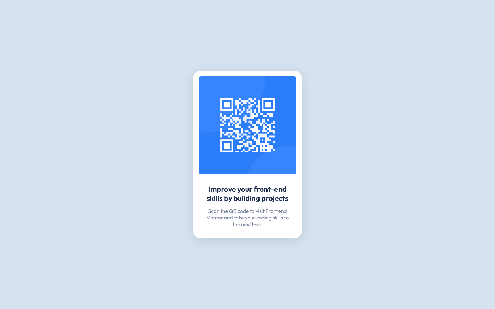

# Frontend Mentor - QR code component solution

This is a solution to the [QR code component challenge on Frontend Mentor](https://www.frontendmentor.io/challenges/qr-code-component-iux_sIO_H). Frontend Mentor challenges help you improve your coding skills by building realistic projects.

## Table of contents

- [Overview](#overview)
  - [Screenshot](#screenshot)
  - [Links](#links)
- [My process](#my-process)
  - [Built with](#built-with)
- [Author](#author)

## Overview

### Screenshot

| Mobile                      | Desktop                      |
| --------------------------- | ---------------------------- |
|  |  |

### Links

- Solution URL: [Frontend Mentor](https://www.frontendmentor.io/solutions/simple-flex-grid-page--olPmTdfi2)
- Live Site URL: [Github Pages](https://zgronska.github.io/qr-code-component/)

## My process

### Built with

- Semantic HTML5 markup
- CSS custom properties
- Flexbox
- CSS Grid
- Mobile-first workflow

## Author

- GitHub - [zgronska](https://github.com/zgronska)
- Frontend Mentor - [@zgronska](https://www.frontendmentor.io/profile/zgronska)
